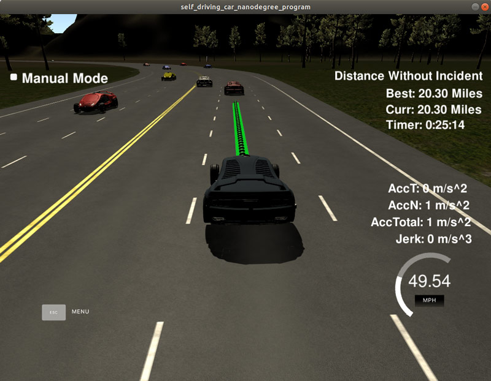
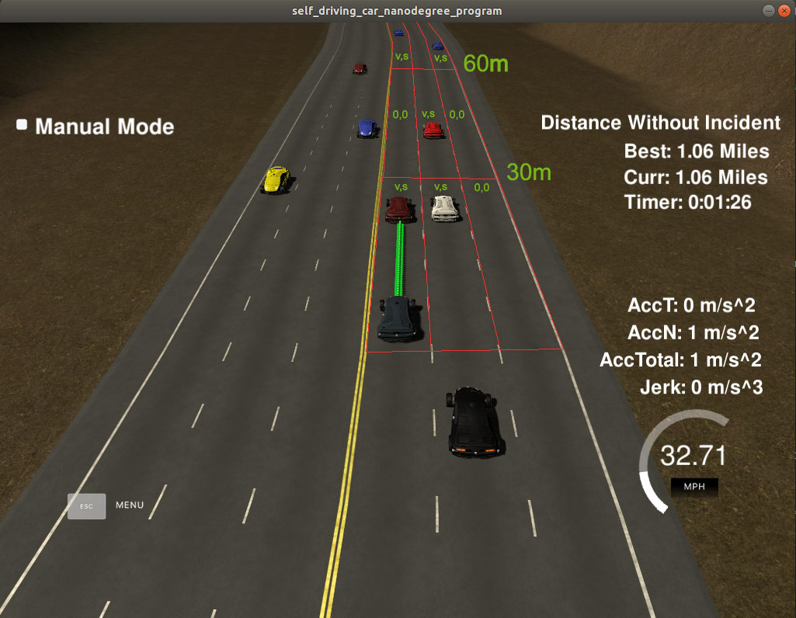

## Self-Driving Car Engineer Nanodegree Program
# Project: Highway Driving

# Introduction

The goal of this project is to navigate a car around a simulated highway with other traffic that is driving +-10 MPH of the 50 MPH speed limit. The highway track is a 3-lane highway on each side. The car's localization data, waypoints, and sensor fusion data are provided by the simulator. The car should drive within a highway lane as close as possible to the 50 MPH speed limit avoiding collisions with other cars. Also, the car must not violate the maximum velocity of 50 MPH, maximum acceleration of 10 m/s^2, and maximum jerk of 50 m/s^3. The car should make one loop around the 6946m highway.

The successful navigation for more than 20 miles around the virtual highway is shown on the following image

# Reflection
The main parts of the project code are Prediction, Behavior Planning, and Trajectory Calculation. This project uses the seed code provided by Udacity. The car is able to drive quite well on the highway more than 20 miles. However, unexpected and complicated situations may occur on the road. Unfortunately, it was hard to repeat such conditions and create a more advanced algorithm. Behavior planner cannot manage complicated situations like other car collisions or uninspected lane changing by other cars. 

## Prediction
The prediction module ( lines 111-155 of main.cpp ) using a matrix 3x3x2 to create a road snapshot. Each lane is divided into 3 segments by 30m and each segment keeps information of the car velocity and car s value. The road matrix is filled with corresponding values from sensor fusion data, so behavior planning module could see the road situation for 90m ahead for 3 lanes and plan the car behavior accordingly.
3x3 matrix was used for simplicity. A bigger matrix with short segments ( like 5 m ) mapping road situation around the car could be used to create advanced behavior.

## Behavior Planning
Behavior planner ( lines 156-220 of main.cpp ) checks the road ahead by checking velocity values in the road matrix. If any car is detected up to 30m ahead on the same lane, it checks 1st and 2nd segments of other lanes in order to find the lane with less traffic. If all lanes are occupied the car decrease it's speed and keeps the lane waiting while adjacent lane will be available again. If the distance rapidly decreases to 15m or less the behavior planner applies "emergency brake" to avoid a possible collision. 

## Trajectory Calculation
Trajectory calculation could be found between the lines 221 and 322 of main.cpp. The concept of trajectory calculation was taken from the Q&A video provided by Udacity.  
 
To create a smooth path trajectory the last points of the previous path are used (if available) as the first anchor points for a new trajectory. Additional three waypoints widely spaced (at 30 meters interval) used for future path generation. Waypoints coordinates are converted to the local coordinate space to make less calculation. The computed waypoints are transformed into a smooth trajectory using a spline. The points are then converted back to frenet coordinates, and fed to the simulator.    

 
# Simulator
You can download the Term3 Simulator which contains the Path Planning Project from the [releases tab (https://github.com/udacity/self-driving-car-sim/releases).

# Basic Build Instructions
Make a build directory: mkdir build && cd build
Compile: cmake .. && make
Run it: ./path_planning.
